# HkDocs

[](https://github.com/hiroaki-com/hkdocs/actions/workflows/deploy_hkdocs_to_cloud_run.yml)
[](https://docusaurus.io/)
[](https://nodejs.org/)
[](https://pnpm.io/)
[](https://opensource.org/licenses/MIT)
[](http://creativecommons.org/licenses/by-sa/4.0/)

A personal knowledge base that consolidates a tech blog, work notes, and a diary. Built with Docusaurus and hosted on Google Cloud Run.

👉 *[https://hkdocs.com/](https://hkdocs.com/)*

🇯🇵 [日本語 Readme](./README.md)

## Features

### Contents
- **Tech & Exam Docs**: `Systematic organization of learnings and records of certification exams.`
- **Blog & Diary**: `A blog for technical learnings and a diary for daily records.`
- **Browser Memo**: `A lightweight, browser-only memo tool.`

### System
- **Multilingual Support**: `Japanese/English support via Docusaurus i18n.`
- **CI/CD Automation**: `Automated deployment from build to Cloud Run via GitHub Actions.`
- **Social Integration**: `Automatically posts new article information to X (formerly Twitter).`

## Tech Stack

| Category         | Technology / Service                                                              |
| ---------------- | --------------------------------------------------------------------------------- |
| Framework        | [Docusaurus](https://docusaurus.io/) `v3.8.0`                                     |
| Language         | [TypeScript](https://www.typescriptlang.org/)                                     |
| UI Library       | [React](https://reactjs.org/) `v19`                                               |
| Package Manager  | [pnpm](https://pnpm.io/) `v10.11.0` (with [Corepack](https://nodejs.org/api/corepack.html)) |
| Containerization | [Docker](https://www.docker.com/), [Docker Compose](https://docs.docker.com/compose/) |
| Hosting          | [Google Cloud Run](https://cloud.google.com/run)                                  |
| CI/CD            | [GitHub Actions](https://github.com/features/actions)                             |
| Search           | [Algolia DocSearch](https://docsearch.algolia.com/)                               |

## System Architecture

```mermaid
graph LR
    subgraph "Developer Actions & CI/CD"
        Developer([fa:fa-user Developer]) -- "① Code Push" --> GitHub(fa:fa-github GitHub)
        GitHub -- "② Trigger" --> Actions(fa:fa-cogs Actions)
        Actions -- "③ Build & Deploy" --> CR(fa:fa-cloud Cloud Run)
        Actions -.-> |Auto-Post| X(fa:fa-twitter X)
    end

    subgraph "User Actions & Site"
        Visitor([fa:fa-users Visitor]) -- "④ View Site" --> CR
        Visitor -- "⑤ Search" <--> Algolia(fa:fa-search Algolia)
    end
```




## Project Specification

Detailed system design and development conventions are managed in the following documents.

- 📘 **[System Specification (English)](./spec/SYSTEM_SPECIFICATION.en.md)**

## Directory Structure

```plaintext
.
├── .github/              # GitHub Actions workflows and scripts
├── blog/                 # Blog posts (Source/Japanese)
├── docs/                 # Technical documents (Source/Japanese)
├── diary/                # Diary entries (Source/Japanese)
├── i18n/                 # Internationalization files (e.g., English translations)
├── src/                  # Custom React components, pages, and CSS
├── static/               # Static assets (e.g., images)
├── spec/                 # System specification documents
├── Dockerfile            # Production Dockerfile for Cloud Run
├── Dockerfile.dev        # Development Dockerfile for local environment
├── docusaurus.config.ts  # Docusaurus site configuration
├── docker-compose.yml    # Docker Compose configuration for development
├── package.json          # Project dependencies and scripts
└── deploy.sh             # Manual deployment script to Google Cloud Run
```

## Getting Started

### Prerequisites

- [Git](https://git-scm.com/)
- [Docker Desktop](https://www.docker.com/products/docker-desktop/) (Recommended)
- Or, for a local environment: [nvm](https://github.com/nvm-sh/nvm) and Node.js `v22.16.0`

### Installation

1.  Clone the repository.
    ```bash
    git clone https://github.com/hiroaki-com/hkdocs.git
    cd hkdocs
    ```

## Development

Using Docker Compose is the recommended method for local development.

### 1: Using Docker Compose (Recommended)

1.  **Build and start the containers**
    Run this for the first time or if `Dockerfile.dev` has changed.
    ```bash
    docker-compose up --build
    ```
    The `--build` flag is not needed for subsequent runs.
    ```bash
    docker-compose up
    ```
    The development server will be available at `http://localhost:3000`.

2.  **i18n Development**
    To start the development server for a specific locale, use the following commands:
    ```bash
    # Develop with the English site
    docker-compose run --rm --service-ports app pnpm start --locale en

    # Develop with the Japanese site
    docker-compose run --rm --service-ports app pnpm start --locale ja
    ```

3.  **Stopping the server**
    After stopping the server with `Ctrl+C`, clean up the containers.
    ```bash
    docker-compose down
    ```

### 2: Using Local Environment

1.  **Environment Setup**
    ```bash
    # 1. Use the Node.js version specified in the project
    nvm use

    # 2. Enable pnpm
    corepack enable pnpm

    # 3. Install dependencies
    pnpm install --frozen-lockfile
    ```

2.  **Starting the development server**
    ```bash
    # Start with the default locale (Japanese)
    pnpm start

    # Start with the English locale
    pnpm start --locale en
    ```
    The development server will be available at `http://localhost:3000`.

## Available Scripts

-   **`pnpm build`**:
    Builds the static files for all languages into the `build/` directory.
-   **`pnpm serve`**:
    Serves the content of the `build/` directory for local preview (at `http://localhost:8080`).
-   **`pnpm typecheck`**:
    Runs the TypeScript type checker.
-   **`pnpm clear`**:
    Clears the Docusaurus cache.

## Deployment

### Automated Deployment

Pushing to the `main` branch triggers the GitHub Actions workflow defined in `.github/workflows/deploy_hkdocs_to_cloud_run.yml`, which automatically builds and deploys the site to Google Cloud Run.

### Manual Deployment

To deploy manually from your local environment, ensure the `gcloud` CLI is configured and then run the following script.

```bash
./deploy.sh
```

## License

-   **Code**: The source code of this project is licensed under the [MIT License](./LICENSE).
-   **Content**: All content within the `blog/`, `diary/`, and `docs/` directories is licensed under [CC BY-SA 4.0](http://creativecommons.org/licenses/by-sa/4.0/).
