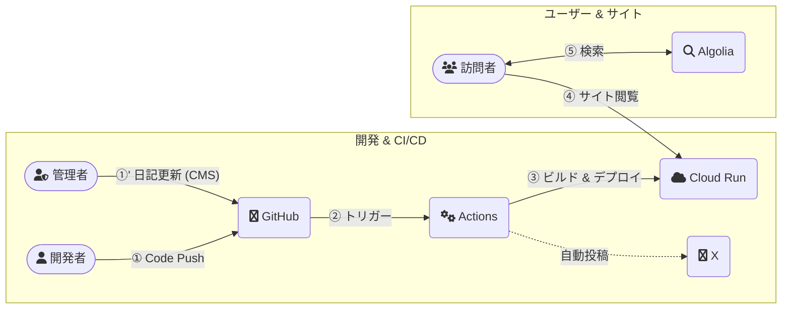

## HkDocs

[](https://github.com/hiroaki-com/hkdocs/actions/workflows/deploy_hkdocs_to_cloud_run.yml)
[](https://docusaurus.io/)
[](https://nodejs.org/)
[](https://pnpm.io/)
[](https://opensource.org/licenses/MIT)
[](http://creativecommons.org/licenses/by-sa/4.0/)

技術ブログ、作業整理、日記などを集約した個人用のナレッジベースサイトです。Docusaurusで構築し、Google Cloud Run上でホストしています。

👉 *[https://hkdocs.com/](https://hkdocs.com/)*

🔤 [English README](./README.en.md)

📘 [システム仕様書](./spec/SYSTEM_SPECIFICATION.md)

### 主な機能

#### コンテンツ
- Tech & Exam Docs: `学びの体系的な整理と、資格試験の記録`
- Blog & Diary: `技術的な学びを綴るブログと、日々の記録を残す日記`
- Browser Memo: `ブラウザ完結型の軽量メモツール`
- News & Links: `日々の情報収集に役立つ国内外のニュースサイト、学習に役立つリファレンスリンク集`

#### システム
- Multilingual Support: `Docusaurus i18nによる日本語／英語 対応`
- CI/CD Automation: `GitHub ActionsによるビルドからCloud Runへの自動デプロイ`
- Social Integration: `新規記事の情報をX (旧Twitter) へ自動投稿`
- CMS Integration: `Decap CMSによる日記コンテンツの更新`

### 技術スタック

| カテゴリ         | 技術・サービス                                                                    |
| ---------------- | --------------------------------------------------------------------------------- |
| フレームワーク   | [Docusaurus](https://docusaurus.io/) `v3.8.0`                                     |
| 言語             | [TypeScript](https://www.typescriptlang.org/)                                     |
| UIライブラリ     | [React](https://reactjs.org/) `v19`                                               |
| パッケージ管理   | [pnpm](https://pnpm.io/) `v10.11.0` (with [Corepack](https://nodejs.org/api/corepack.html)) |
| コンテナ化       | [Docker](https://www.docker.com/), [Docker Compose](https://docs.docker.com/compose/) |
| ホスティング     | [Google Cloud Run](https://cloud.google.com/run)                                  |
| CI/CD            | [GitHub Actions](https://github.com/features/actions)                             |
| 検索             | [Algolia DocSearch](https://docsearch.algolia.com/)                               |
| コンテンツ管理   | [Decap CMS](https://decapcms.org/)|

### システム構成



### ディレクトリ構成

```plaintext
.
├── .github/              # GitHub Actionsのワークフローとスクリプト
│   ├── scripts/
│   └── workflows/
├── blog/                 # ブログ記事 (日本語)
├── docs/                 # 技術ドキュメント (日本語)
│   ├── exams/
│   └── tech/
├── diary/                # 日記 (日本語)
├── i18n/                 # 国際化対応ファイル (例: 英語翻訳)
│   └── en/
├── src/                  # ソースコードディレクトリ
│   ├── components/       # カスタムReactコンポーネント
│   ├── pages/            # カスタムページ (ニュース、プロフィールなど)
│   └── css/              # カスタムCSS
├── static/               # 静的アセット (画像、CMS設定など)
│   └── admin/            # Decap CMS（コンテンツ管理システム）の設定
├── spec/                 # システム仕様書
├── Dockerfile            # 本番環境用Dockerfile (Cloud Run)
├── Dockerfile.dev        # 開発環境用Dockerfile
├── docusaurus.config.ts  # Docusaurusサイト設定
├── docker-compose.yml    # 開発用Docker Compose設定
├── package.json          # プロジェクトの依存関係とスクリプト
└── deploy.sh             # 手動デプロイスクリプト (Google Cloud Run)
```

### はじめに

#### 前提条件

- [Git](https://git-scm.com/)
- [Docker Desktop](https://www.docker.com/products/docker-desktop/) (推奨)
- または、ローカル環境用の [nvm](https://github.com/nvm-sh/nvm) と Node.js `v22.16.0`

#### インストール

1.  リポジトリをクローンします。
    ```bash
    git clone https://github.com/hiroaki-com/hkdocs.git
    cd hkdocs
    ```

### 開発

ローカルでの開発は、Docker Composeを使用する方法を推奨します。

#### 1. Docker Composeを使用する (推奨)

1.  **コンテナをビルドして起動**
    初回、または`Dockerfile.dev`に変更があった場合に実行します。
    ```bash
    docker-compose up --build
    ```
    2回目以降は `--build` フラグは不要です。
    ```bash
    docker-compose up
    ```
    開発サーバーは `http://localhost:3000` で利用可能になります。

2.  **多言語(i18n)開発**
    特定の言語で開発サーバーを起動する場合は、以下のコマンドを使用します。
    ```bash
    # 英語サイトで開発する場合
    docker-compose run --rm --service-ports app pnpm start --locale en

    # 日本語サイトで開発する場合
    docker-compose run --rm --service-ports app pnpm start --locale ja
    ```

3.  **停止**
    `Ctrl+C`でサーバーを停止後、コンテナをクリーンアップします。
    ```bash
    docker-compose down
    ```

#### 2. ローカル環境を使用する

1.  **環境設定**
    ```bash
    # 1. プロジェクトで指定されたNode.jsバージョンを使用
    nvm use

    # 2. pnpmを有効化
    corepack enable pnpm

    # 3. 依存関係をインストール
    pnpm install --frozen-lockfile
    ```

2.  **開発サーバーの起動**
    ```bash
    # デフォルト言語 (日本語) で起動
    pnpm start

    # 英語で起動
    pnpm start --locale en
    ```
    開発サーバーは `http://localhost:3000` で利用可能になります。

### 利用可能なスクリプト

-   **`pnpm build`**:
    全言語の静的ファイルを `build/` ディレクトリに生成します。
-   **`pnpm serve`**:
    `build/` ディレクトリの内容をローカルでプレビューします（`http://localhost:8080`）。
-   **`pnpm typecheck`**:
    TypeScriptの型チェックを実行します。
-   **`pnpm clear`**:
    Docusaurusのキャッシュを削除します。

### デプロイ

#### 自動デプロイ

`main`ブランチにプッシュすると、`.github/workflows/deploy_hkdocs_to_cloud_run.yml` で定義されたGitHub Actionsワークフローがトリガーされ、ビルドとGoogle Cloud Runへのデプロイが自動的に実行されます。

#### 手動デプロイ

ローカル環境から手動でデプロイする場合は、`gcloud` CLIが設定されていることを確認の上、以下のスクリプトを実行します。

```bash
./deploy.sh
```

### ライセンス

-   **コード**: このプロジェクトのソースコードは [MITライセンス](./LICENSE) の下で公開されています。
-   **コンテンツ**: `blog/`, `diary/`, `docs/` ディレクトリ内のすべてのコンテンツは [CC BY-SA 4.0](http://creativecommons.org/licenses/by-sa/4.0/) の下で公開されています。
