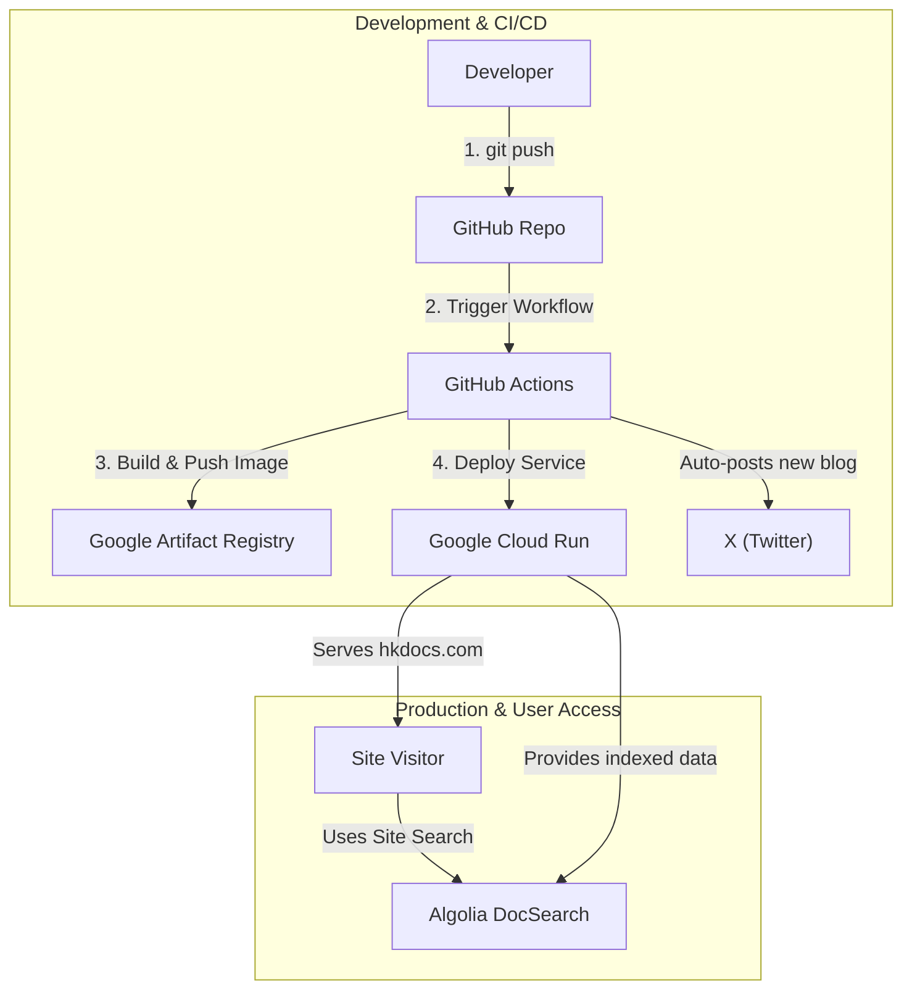

# HkDocs

[](https://github.com/hiroaki-com/hkdocs/actions/workflows/deploy_hkdocs_to_cloud_run.yml)
[](https://docusaurus.io/)
[](https://nodejs.org/)
[](https://pnpm.io/)
[](https://opensource.org/licenses/MIT)
[](http://creativecommons.org/licenses/by-sa/4.0/)

個人の技術ブログ、ドキュメント、日記などを集約したナレッジベースサイトです。Docusaurusで構築され、Google Cloud Run上でホストされています。

**[https://hkdocs.com/](https://hkdocs.com/)**

[English README](./README.en.md)

## Features

- **Tech Blog**: 技術的な知見や開発ログを公開。
- **Documents**: 特定技術のドキュメントや試験対策ノートを体系的に整理。
- **Diary**: 日々の記録や思考をまとめた日記。
- **Internationalization (i18n)**: 日本語と英語のコンテンツに完全対応。
- **Automated Deployments**: `main`ブランチへのプッシュで、GitHub Actionsが自動的にビルドとデプロイを実行。

## Tech Stack

| Category         | Technology / Service                                                              |
| ---------------- | --------------------------------------------------------------------------------- |
| Framework        | [Docusaurus](https://docusaurus.io/) `v3.8.0`                                     |
| Language         | [TypeScript](https://www.typescriptlang.org/)                                     |
| UI Library       | [React](https://reactjs.org/) `v19`                                               |
| Package Manager  | [pnpm](https://pnpm.io/) `v10.11.0` (with [Corepack](https://nodejs.org/api/corepack.html)) |
| Containerization | [Docker](https://www.docker.com/), [Docker Compose](https://docs.docker.com/compose/) |
| Hosting          | [Google Cloud Run](https://cloud.google.com/run)                                  |
| CI/CD            | [GitHub Actions](https://github.com/features/actions)                             |
| Search           | [Algolia DocSearch](https://docsearch.algolia.com/)                               |

## System Architecture

開発からデプロイ、ユーザーアクセスまでの流れは以下の通りです。



## Directory Structure

```plaintext
.
├── .github/              # GitHub Actions workflows and scripts
├── blog/                 # Blog posts (Japanese)
├── docs/                 # Technical documents (Japanese)
├── diary/                # Diary entries (Japanese)
├── i18n/                 # Internationalization files (e.g., English translations)
├── src/                  # Custom React components, pages, and CSS
├── static/               # Static assets (e.g., images)
├── Dockerfile            # Production Dockerfile for Cloud Run
├── Dockerfile.dev        # Development Dockerfile for local environment
├── docusaurus.config.ts  # Docusaurus site configuration
├── docker-compose.yml    # Docker Compose configuration for development
├── package.json          # Project dependencies and scripts
└── deploy.sh             # Manual deployment script to Google Cloud Run
```

## Getting Started

### Prerequisites

- [Git](https://git-scm.com/)
- [Docker Desktop](https://www.docker.com/products/docker-desktop/) (推奨)
- または、ローカル環境用の [nvm](https://github.com/nvm-sh/nvm) と Node.js `v22.16.0`

### Installation

1.  リポジトリをクローンします。
    ```bash
    git clone https://github.com/hiroaki-com/hkdocs.git
    cd hkdocs
    ```

## Development

ローカルでの開発は、Docker Composeを使用する方法を推奨します。

### Method 1: Using Docker Compose (Recommended)

1.  **コンテナをビルドして起動**
    初回、または`Dockerfile.dev`に変更があった場合に実行します。
    ```bash
    docker-compose up --build
    ```
    2回目以降は `--build` フラグは不要です。
    ```bash
    docker-compose up
    ```
    開発サーバーは `http://localhost:3000` で利用可能になります。

2.  **多言語(i18n)開発**
    特定の言語で開発サーバーを起動する場合は、以下のコマンドを使用します。
    ```bash
    # 英語サイトで開発
    docker-compose run --rm --service-ports app pnpm start --locale en

    # 日本語サイトで開発
    docker-compose run --rm --service-ports app pnpm start --locale ja
    ```

3.  **停止**
    `Ctrl+C`でサーバーを停止後、コンテナをクリーンアップします。
    ```bash
    docker-compose down
    ```

### Method 2: Using Local Environment

1.  **環境設定**
    ```bash
    # 1. プロジェクトで指定されたNode.jsバージョンを使用
    nvm use

    # 2. pnpmを有効化
    corepack enable pnpm

    # 3. 依存関係をインストール
    pnpm install --frozen-lockfile
    ```

2.  **開発サーバーの起動**
    ```bash
    # デフォルト言語 (日本語) で起動
    pnpm start

    # 英語で起動
    pnpm start --locale en
    ```
    開発サーバーは `http://localhost:3000` で利用可能になります。

## Available Scripts

-   **`pnpm build`**:
    全言語の静的ファイルを `build/` ディレクトリに生成します。
-   **`pnpm serve`**:
    `build/` ディレクトリの内容をローカルでプレビューします（`http://localhost:8080`）。
-   **`pnpm typecheck`**:
    TypeScriptの型チェックを実行します。
-   **`pnpm clear`**:
    Docusaurusのキャッシュを削除します。

## Deployment

### Automated Deployment

`main`ブランチにプッシュすると、`.github/workflows/deploy_hkdocs_to_cloud_run.yml` で定義されたGitHub Actionsワークフローがトリガーされ、ビルドとGoogle Cloud Runへのデプロイが自動的に実行されます。

### Manual Deployment

ローカル環境から手動でデプロイする場合は、`gcloud` CLIが設定されていることを確認の上、以下のスクリプトを実行します。

```bash
./deploy.sh
```

## License

-   **Code**: The source code of this project is licensed under the [MIT License](./LICENSE).
-   **Content**: All content within the `blog/`, `diary/`, and `docs/` directories is licensed under [CC BY-SA 4.0](http://creativecommons.org/licenses/by-sa/4.0/).
