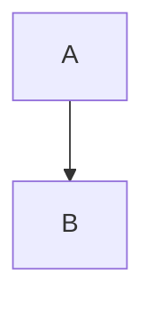

import Admonition from '@theme/Admonition';
import ShareButtons from '@site/src/components/ShareButtons';

以前実装した [ブラウザメモ](/browser-memo) および [URL共有機能](/tech/docusaurus/enhancing-browser-memo-with-url-sharing-and-ux-improvements.mdx) に続き、今回はMermaid記法によるダイアグラム描画機能を追加実装しました。

本記事では、既存のMarkdownプレビュー機能を拡張し、テキストベースで図形を描画・プレビューする仕組みの技術選定と実装ポイントを整理します。

#### 1. 背景と動機：思考整理を1つのタブで完結させたい

現在運用中の「ブラウザメモ帳」は、Markdownプレビュー、ローカルストレージ保存、URL共有といった機能を備え、日々のちょっとしたメモ書きに重宝しています。

しかし、複雑な処理フローや構成図を整理したい場合、テキストだけでは限界がありました。かといって、そのたびにMiroやDraw.ioのような外部ツールを開くのは、「思考の整理」という文脈では少々大げさで、コンテキストスイッチのコストもかかります。

そこで、「同じタブ内で、テキストと同様の手軽さで図を描く」ことを目標に、Mermaidのサポートを追加することにしました。

{/* truncate */}

#### 2. 技術選定と実装方針

作図エンジンには、Markdownエコシステムでデファクトスタンダードとなっている `mermaid` を採用しました。
既存のプレビュー機能は `react-markdown` で実装されているため、このレンダリングフローに介入するアプローチをとります。

<Admonition type="info" title="実装のアプローチ">
<ol>
  <li><code>react-markdown</code> の <code>components</code> プロパティを利用し、特定のHTMLタグの描画をジャックする。</li>
  <li>コードブロック（<code>&lt;code&gt;</code>）の中で、言語指定クラスが <code>language-mermaid</code> であるものを検出する。</li>
  <li>検出されたブロックを、通常のコード表示ではなく、自作の <code>&lt;MermaidPreview&gt;</code> コンポーネントに差し替えてレンダリングする。</li>
</ol>
</Admonition>

#### 3. 実装のポイント

##### MermaidPreviewコンポーネントの実装

Mermaidの描画処理をReactコンポーネントとして切り出します。主な役割は、受け取ったテキスト（Mermaid記法）をSVGに変換し、DOMに反映することです。

*   `mermaid.run`: DOM要素をスキャンしてSVGを生成するAPIを使用。
*   再描画の制御: `useEffect` を使い、入力テキストが変更されるたびに図を更新します。
*   テーマ同期: Docusaurusのダークモード設定（`html[data-theme='dark']`）を検知し、Mermaidのテーマも自動で切り替えるように調整しました。

また、Docusaurus環境下では依存関係の競合（Ghost Dependency）を避けるため、明示的に `pnpm add mermaid` でパッケージを追加しています。

##### React Markdownでのコンポーネント置換

ブログ等でよく使われる手法ですが、`react-markdown` の `components` プロパティでレンダリングをカスタマイズします。
ここでのポイントは、正規表現によるクラス名の解析です。

```tsx title="PreviewComponent.tsx"
import ReactMarkdown from 'react-markdown';
import remarkGfm from 'remark-gfm';
import MermaidPreview from './MermaidPreview'; // 自作コンポーネント

// ...

<ReactMarkdown 
  remarkPlugins={[remarkGfm]}
  components={{
    code(props) {
      const { children, className, node, ...rest } = props;
      // "language-mermaid" のクラスを持つコードブロックを正規表現で検出
      const match = /language-(\w+)/.exec(className || '');
      
      if (match && match[1] === 'mermaid') {
        // 末尾の改行を除去してMermaidコンポーネントに渡す
        return <MermaidPreview chart={String(children).replace(/\n$/, '')} />;
      }
      
      // それ以外は通常のコードブロックとして表示
      return <code className={className} {...rest}>{children}</code>;
    }
  }}
>
  {previewText}
</ReactMarkdown>
```

#### 4. UXデザインの意思決定：標準記法の採用

実装にあたり、「独自記法にするか、標準的なコードブロック記法にするか」という論点がありましたが、標準的なコードブロック記法（fence code block）を採用しました。





理由は以下の3点です。

1.  干渉回避: 通常のメモ書き（「graph」などの単語）が勝手に図として解釈される誤動作を防ぐため。
2.  ポータビリティ（移植性）: GitHub、Notion、VSCodeなど、エンジニアが常用するツールの記法と合わせることで、メモの内容をそのままGitHub Issue等にコピペしても図として機能するようにしたかったため。
3.  技術的標準: Markdownのエコシステムにおいて最も標準的な拡張方法であるため。

#### 5. 結果と成果

この機能追加により、`graph TD; A-->B;` とタイプするだけで、右側のプレビュー画面に即座にフローチャートが表示されるようになりました。

また、[前回実装したURL共有機能](/tech/docusaurus/enhancing-browser-memo-with-url-sharing-and-ux-improvements.mdx)はテキストデータを対象としているため、Mermaid記法で書いた図も含めて、URL一つでそのまま他人に共有可能です。

### まとめ

Markdownプレビュー機能を持つアプリへのMermaid導入は、`react-markdown`の拡張機構を使うことで比較的スムーズに実装できます。

*   コンポーネント置換が鍵: `components` プロパティで `code` タグのレンダリングを乗っ取り、Mermaid用の処理を差し込む。
*   標準記法を守る: 独自記法ではなく ` ```mermaid ` を採用することで、他のツールとの互換性とコピペのしやすさを維持する。
*   URL共有との相性: テキストベースの図解はデータサイズが小さく、LZString圧縮によるURL共有機能とも非常に相性が良い。

テキストベースの思考整理ツールとして、また一つ実用的な機能強化ができました。

<br/>
<ShareButtons />
<br/>

<Admonition type="note" title="参考文献">
<ul>
    <li><a href="https://mermaid.js.org/" target="_blank" rel="noopener noreferrer">Mermaid | Diagramming and charting tool</a></li>
    <li><a href="https://github.com/remarkjs/react-markdown" target="_blank" rel="noopener noreferrer">GitHub | remarkjs/react-markdown</a></li>
</ul>
</Admonition>
