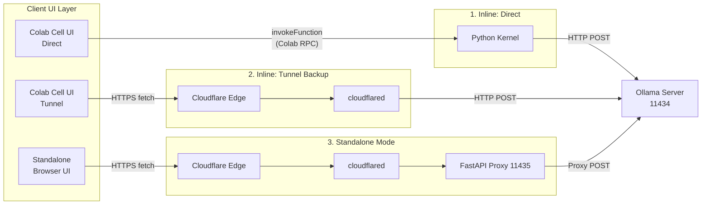
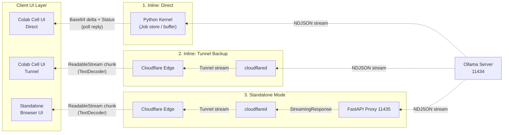

import Admonition from '@theme/Admonition';
import ShareButtons from '@site/src/components/ShareButtons';
import GitHubStarLink from '@site/src/components/GitHubStarLink';

<GitHubStarLink repo="hiroaki-com/colab-ollama-private-chat" />

ChatGPTやClaudeのようなLLMサービスは便利ですが、業務上の機密情報や個人的な内容を入力するのには少し気が引ける場面があります。また最近は次々と新しいローカルLLMのモデルが登場していて、気軽に試してみたい気持ちもある。かといって、ローカルにGPUを用意してOllamaを動かすのも、環境構築の手間やハードウェアコストの面でハードルが高い。

そこで、Google ColabのGPUを使い、会話ログを一切外部に送らずに済むプライベートなLLMチャット環境をノートブック1つで完結させるツールを作りました。セルを上から順に実行するだけで、Ollamaサーバーの起動からチャットUIの表示まで、コードを書かずに使い始められます。

{/* truncate */}

### 作ったもの

<Admonition type="tip" title="🚀 今すぐ試す">
  面倒な環境構築は不要です。以下のリンクからブラウザ上ですぐに実行できます。

  <ul>
    <li style={{ marginBottom: '12px' }}>
      ⚡️ Google Colab で実行する<br/>
      <a href="https://colab.research.google.com/github/hiroaki-com/colab-ollama-private-chat/blob/main/ollama_colab_private_chat_ja.ipynb" target="_blank" rel="noopener noreferrer">Ollama Colab Private Chat（日本語版）</a><br/>

      <small style={{ color: 'var(--ifm-color-content-secondary)' }}>クリックしてセルを上から順に実行するだけで動きます。</small>
    </li>
    <li>
      🐙 GitHub でコードを見る<br/>
      <a href="https://github.com/hiroaki-com/colab-ollama-private-chat" target="_blank" rel="noopener noreferrer">hiroaki-com/colab-ollama-private-chat</a><br/>
      <small style={{ color: 'var(--ifm-color-content-secondary)' }}>ソースコードの確認や、Star / Fork はこちらから。</small>
    </li>
  </ul>
</Admonition>

主な特徴は3つです。完全無料・外部API非依存・Colabインスタンス内での完結推論によるプライバシー保護、ログを一切保存しないステートレス設計（ブラウザリロードで即時消去）、そして環境構築不要でサーバー起動からUI描画まで同一ノートブック内に収まっていること。

チャットUIは2種類用意しています。Colabのセル出力内で動く `Inline モード` と、ブラウザの別タブで動く `Standalone モード` です。Standaloneモードは専用URLが発行されるため、スマートフォンなど他の端末からもアクセスできます。

### なぜこれを作ったのか

以前から、機密情報を含む可能性のある文章を外部のLLMサービスに送ることへの抵抗がありました。Ollamaを使えばモデルをローカルで動かせますが、自前のGPU環境を持っていない場合は選択肢が限られます。

Google ColabにはT4 GPUが無料で使える環境があり、Ollamaはそのまま動きます。ただ、「Colabを開いてOllamaを起動してチャットする」という一連の流れを毎回手作業でやるのは現実的ではないため、一つのノートブックに全工程を閉じ込めることにしました。

### 主な機能と技術的なポイント

実装の中でこだわった点をいくつか紹介します。

まず全体像として、3種類の通信ルートを整理しておきます。Inlineのダイレクト通信はColabカーネル内で完結するのに対し、StandaloneモードはFastAPIプロキシを経由してCloudflare Tunnelに流れるなど、モードによって経路が大きく異なります。

リクエストの流れ（Upstream）：



レスポンスの流れ（Downstream）：



Inline Directだけは `invokeFunction` を使ってColabカーネル経由でOllamaと通信し、レスポンスをbase64デルタとしてポーリングで返す独特な構成です。TunnelルートとスタンドアロンルートはどちらもCloudflare Tunnelを通しますが、後者はFastAPIがプロキシ層として挟まっています。この違いが後述するそれぞれの実装上の判断につながっています。

- **ipywidgetsによるモデル選択UI**

    > **ipywidgets** はJupyterノートブック（およびGoogle Colab）上でインタラクティブなUIウィジェットを表示するためのライブラリです。スライダーやボタン、ラジオボタンなどをPythonコードだけで描画できます。

    `Model Registry` セルでは、ipywidgetsの `RadioButtons` を使ってモデル選択UIを描画しています。モデル名はカンマ区切りの文字列パラメーターで管理しており、Colabの `#@param` 記法と組み合わせることでフォームUIとして表示されます。選択されたモデル名は `model_selector.value` で後続のセルから参照できます。

    ```python
    model_selector = widgets.RadioButtons(
        options=AVAILABLE_MODELS,
        value=AVAILABLE_MODELS[0],
        layout=widgets.Layout(margin='0 0 0 20px')
    )
    display(widgets.VBox([header, model_selector]))
    ```

- **subprocess.Popenによるバックグラウンドプロセス管理**

    > **subprocess.Popen** はPythonから外部プロセスを非ブロッキングで起動するための標準ライブラリです。`subprocess.run` と異なり、プロセスの完了を待たずに次の処理へ進めるため、サーバープロセスのような常駐型プロセスの起動に適しています。

    Ollamaサーバーは `subprocess.Popen` でバックグラウンド起動しています。起動後すぐに次の処理へ進み、ポーリングループで `/api/tags` エンドポイントへの疎通確認が取れるまで待機する設計にしました。これにより起動タイミングのずれによるエラーを防いでいます。

    ```python
    subprocess.Popen(
        ["/usr/local/bin/ollama", "serve"],
        stdout=subprocess.DEVNULL,
        stderr=subprocess.DEVNULL,
        env=os.environ
    )

    for _ in range(MAX_HEALTH_RETRIES):
        try:
            if requests.get("http://0.0.0.0:11434/api/tags", timeout=HEALTH_CHECK_TIMEOUT).status_code == 200:
                break
        except requests.exceptions.RequestException:
            pass
        time.sleep(0.4)
    ```

- **Ollamaの環境変数によるメモリ最適化**

    > **OLLAMA_FLASH_ATTENTION / OLLAMA_KV_CACHE_TYPE** はOllamaが参照する環境変数で、Transformerモデルの推論効率を制御します。Flash AttentionはAttention計算のメモリ効率を改善し、KVキャッシュの量子化（`q8_0`）はVRAM使用量を削減します。

    ColabのT4 GPUは16GBのVRAMを持ちますが、モデルのサイズによってはKVキャッシュが圧迫されます。`OLLAMA_FLASH_ATTENTION=1` と `OLLAMA_KV_CACHE_TYPE=q8_0` を設定することで、より大きなコンテキスト長を扱えるようになります。また、`OLLAMA_MAX_LOADED_MODELS=1` を指定して複数モデルの同時ロードによるVRAM枯渇を防いでいます。

    ```python
    os.environ['OLLAMA_FLASH_ATTENTION']   = '1'
    os.environ['OLLAMA_KV_CACHE_TYPE']     = 'q8_0'
    os.environ['OLLAMA_MAX_LOADED_MODELS'] = '1'
    os.environ['OLLAMA_KEEP_ALIVE']        = '24h'
    ```

- **Cloudflare TunnelによるColabへの外部アクセス**

    > **Cloudflare Tunnel（cloudflared）** はCloudflareが提供するゼロトラストトンネリングツールです。ファイアウォールの内側にあるローカルポートを、アカウント登録もトークンも不要で一時的な公開URLとして外部に公開できます。ngrokの代替として使えますが、ngrokと異なりサインアップなしで利用できる点が特徴です。

    ColabのランタイムはGoogle側のインフラ上で動いており、直接外部からアクセスする手段がありません。`cloudflared tunnel --url` コマンドで `localhost:11434` にトンネルを張り、`stderr` から `trycloudflare.com` のURLを正規表現で抽出することで外部アクセス用のエンドポイントを取得しています。このURLはStandaloneモードや他デバイスからのアクセスに使用します。

    ```python
    cf_proc = subprocess.Popen(
        ['cloudflared', 'tunnel', '--url', 'http://localhost:11434'],
        stdout=subprocess.DEVNULL, stderr=subprocess.PIPE
    )
    for line in iter(cf_proc.stderr.readline, b''):
        m = re.search(r'https://[a-z0-9-]+\.trycloudflare\.com', line.decode())
        if m:
            public_url = m.group(0)
            break
    ```

- **google.colab.outputによるJavaScript–Pythonブリッジとストリーミング**

    > **google.colab.output.register_callback** はColab固有のAPIで、セル内のJavaScriptからPythonカーネルの関数を呼び出せるようにします。通常のJupyterではWebSocketベースのカーネル通信が必要ですが、Colabではこの仕組みで双方向通信を実現できます。

    Inlineモードのストリーミングは、Python側でスレッドを使ってOllamaからチャンクを非同期受信しながら、JavaScriptからのポーリングで差分を返す設計にしました。`_stream_start` でスレッドを起動してジョブIDを返し、JavaScriptが一定間隔で `_stream_poll` を呼び出して未読部分のbase64エンコードされたバイト列を受け取ります。

    ```python
    def _stream_start(model, messages, ctx):
        job_id = uuid.uuid4().hex
        _stream_jobs[job_id] = {'buf': b'', 'done': False, 'error': None, 'cancel': threading.Event()}
        def _run():
            with requests.post("http://localhost:11434/api/chat", json=payload, stream=True) as r:
                for line in r.iter_lines():
                    chunk = json.loads(line).get('message', {}).get('content', '')
                    _stream_jobs[job_id]['buf'] += chunk.encode('utf-8')
        threading.Thread(target=_run, daemon=True).start()
        return job_id

    def _stream_poll(job_id, offset=0):
        delta_bytes = _stream_jobs[job_id]['buf'][offset:]
        buf_b64 = base64.b64encode(delta_bytes).decode()
        return ('DONE' if is_done else 'WAIT') + '|' + buf_b64 + '|'

    output.register_callback("ollama_stream_start", _stream_start)
    output.register_callback("ollama_stream_poll",  _stream_poll)
    ```

    JavaScriptからは `google.colab.kernel.invokeFunction("ollama_stream_start", ...)` で呼び出します。受け取ったbase64文字列をデコードしてチャットバブルに追記することでリアルタイムなストリーミング表示を実現しています。

- **FastAPI + uvicornによるStandaloneモード**

    > **FastAPI** はPythonの非同期対応Webフレームワークです。**uvicorn** はASGIサーバーの実装で、FastAPIアプリケーションを実行するために使います。両者を組み合わせることで、ColabのPythonカーネル上に小さなWebサーバーを立ち上げることができます。

    StandaloneモードではColabのセル出力に依存できないため、FastAPIアプリをuvicornで起動し、独立したHTMLページをホストする構成にしました。uvicornは `threading.Thread` でバックグラウンド起動し、Ollamaへのリクエストは `httpx` でプロキシしてStandaloneモードのフロントエンドに `StreamingResponse` で返しています。

    ```python
    app = FastAPI()

    @app.get("/", response_class=HTMLResponse)
    async def index():
        return _STANDALONE_UI_HTML

    @app.post("/api/chat")
    async def chat_proxy(request: Request):
        body = await request.json()
        async def generate():
            async with httpx.AsyncClient(timeout=300) as client:
                async with client.stream("POST", "http://localhost:11434/api/chat", json=body) as r:
                    async for chunk in r.aiter_bytes():
                        yield chunk
        return StreamingResponse(generate(), media_type="application/x-ndjson")

    threading.Thread(
        target=uvicorn.run,
        kwargs={"app": app, "host": "0.0.0.0", "port": 11435},
        daemon=True
    ).start()
    ```

    Cloudflare Tunnelのエンドポイントも別途 `localhost:11435` 向けに起動しており、発行されたURLにアクセスするだけでスマートフォンを含む任意のデバイスからチャットができます。

- **marked.js + DOMPurifyによるMarkdownレンダリング**

    > **marked.js** はブラウザ上でMarkdown文字列をHTMLに変換するJavaScriptライブラリです。**DOMPurify** は変換後のHTMLからスクリプトインジェクション（XSS）につながる要素を取り除くサニタイズライブラリです。

    LLMの応答にはコードブロックや箇条書きなどのMarkdown記法が含まれることが多いため、チャットバブルへの表示前に `marked.parse()` でHTMLに変換しています。変換後は必ず `DOMPurify.sanitize()` を通すことで、モデルが悪意あるHTMLを出力した場合でもXSSを防ぐようにしました。

    ```javascript
    const html = DOMPurify.sanitize(marked.parse(rawText));
    bubble.innerHTML = html;
    ```

### 使い方

セルを上から順に実行するだけです。

1. Model Registry: 使いたいモデル名をカンマ区切りで入力し、ラジオボタンで1つ選択します。モデル名は [ollama.com/search](https://ollama.com/search) で確認できます。
2. Server: Ollamaのインストール、モデルのダウンロード、Cloudflare Tunnelの起動が自動で走ります。初回はモデルのダウンロードに数分かかります。
3. Chat UI: `Inline`（セル内で動作）か `Standalone`（別タブ）のどちらかを実行してチャットを開始します。

`num_ctx` パラメーターでコンテキスト長（デフォルト4096トークン）を調整できます。扱うモデルのサイズとVRAM使用量のバランスを見ながら変更してください。


### まとめ

「外部APIを使わずにColabでLLMとチャットしたい」という自分自身の需要から作り始めたツールです。Ollamaのサーバー管理、Cloudflare Tunnelによるアクセス確保、Colabの制約に合わせたストリーミング設計など、ピースをつなぎ合わせる部分でそれなりに試行錯誤しました。特にInlineモードのJavaScript–Pythonブリッジはコールバック登録のタイミングやポーリング方式の選択に悩みましたが、ノートブック単体で完結するという制約の中では現実的な落とし所に着地できたと思っています。

プライバシーを気にしながらLLMを使いたい方、あるいはColabのGPUをもう少し活用したい方の参考になれば幸いです。

<ShareButtons />

<GitHubStarLink repo="hiroaki-com/colab-ollama-private-chat" />

### 参考文献

- [Ollama Documentation](https://github.com/ollama/ollama/blob/main/docs/README.md)
- [Ollama API Reference](https://github.com/ollama/ollama/blob/main/docs/api.md)
- [Cloudflare Tunnel Documentation](https://developers.cloudflare.com/cloudflare-one/connections/connect-networks/)
- [Google Colab](https://colab.research.google.com/)
- [ipywidgets Documentation](https://ipywidgets.readthedocs.io/)
- [FastAPI Documentation](https://fastapi.tiangolo.com/)
- [marked.js](https://marked.js.org/)
- [DOMPurify](https://github.com/cure53/DOMPurify)
