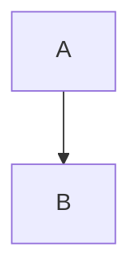

import Admonition from '@theme/Admonition';
import ShareButtons from '@site/src/components/ShareButtons';
import GitHubStarLink from '@site/src/components/GitHubStarLink';

<GitHubStarLink repo="hiroaki-com/hkdocs" />

Following the implementation of the [Browser Memo](/browser-memo) and the [URL Sharing Feature](/tech/docusaurus/enhancing-browser-memo-with-url-sharing-and-ux-improvements.mdx), I have now added a diagram drawing feature using Mermaid syntax.

This article summarizes the technology selection and implementation points for extending the existing Markdown preview function to draw and preview diagrams based on text.

#### 1. Background and Motivation: Completing Thought Organization in One Tab

The currently operating "Browser Notepad" features Markdown preview, local storage persistence, and URL sharing, making it very useful for daily quick note-taking.

However, text alone was limiting when trying to organize complex processing flows or configuration diagrams. At the same time, opening external tools like Miro or Draw.io felt a bit excessive for the context of "organizing thoughts," and the cost of context switching was a concern.

Therefore, I decided to add Mermaid support with the goal of **"drawing diagrams within the same tab with the same ease as text."**

{/* truncate */}

#### 2. Technology Selection and Implementation Strategy

I adopted **`mermaid`**, which is the *de facto* standard in the Markdown ecosystem, as the drawing engine.
Since the existing preview function is implemented with **`react-markdown`**, I took the approach of intervening in its rendering flow.

<Admonition type="info" title="Implementation Approach">
<ol>
  <li>Use the <code>components</code> prop of <code>react-markdown</code> to hijack the rendering of specific HTML tags.</li>
  <li>Detect code blocks (<code>&lt;code&gt;</code>) where the language specification class is <code>language-mermaid</code>.</li>
  <li>Replace the detected blocks with a custom <code>&lt;MermaidPreview&gt;</code> component instead of the standard code display.</li>
</ol>
</Admonition>

#### 3. Implementation Points

##### Implementation of MermaidPreview Component

I extracted the Mermaid drawing logic as a React component. Its main role is to convert the received text (Mermaid syntax) into SVG and reflect it in the DOM.

*   **`mermaid.run`**: Used the API to scan DOM elements and generate SVGs.
*   **Repaint Control**: Used `useEffect` to update the diagram whenever the input text changes.
*   **Theme Synchronization**: Adjusted it to detect Docusaurus's dark mode setting (`html[data-theme='dark']`) and automatically switch the Mermaid theme as well.

Also, to avoid dependency conflicts (Ghost Dependencies) in the Docusaurus environment, I explicitly added the package via `pnpm add mermaid`.

##### Component Replacement in React Markdown

This is a common technique used in blogs, customizing rendering via the `components` prop of `react-markdown`.
The key point here is **parsing class names with regular expressions**.

```tsx title="PreviewComponent.tsx"
import ReactMarkdown from 'react-markdown';
import remarkGfm from 'remark-gfm';
import MermaidPreview from './MermaidPreview'; // Custom component

// ...

<ReactMarkdown 
  remarkPlugins={[remarkGfm]}
  components={{
    code(props) {
      const { children, className, node, ...rest } = props;
      // Detect code blocks with the "language-mermaid" class using regex
      const match = /language-(\w+)/.exec(className || '');
      
      if (match && match[1] === 'mermaid') {
        // Remove trailing newline and pass to Mermaid component
        return <MermaidPreview chart={String(children).replace(/\n$/, '')} />;
      }
      
      // Render as a normal code block otherwise
      return <code className={className} {...rest}>{children}</code>;
    }
  }}
>
  {previewText}
</ReactMarkdown>
```

#### 4. UX Design Decision: Adopting Standard Syntax

During implementation, there was a debate on whether to use "custom syntax or standard code block syntax," but I decided to adopt the **standard code block syntax (fence code block)**.





The reasons are the following three points:

1.  **Interference Avoidance**: To prevent normal notes (words like "graph") from being interpreted as diagrams unintentionally.
2.  **Portability**: To ensure that notes can be copied and pasted directly into GitHub Issues or other tools commonly used by engineers (GitHub, Notion, VSCode) and still function as diagrams.
3.  **Technical Standard**: Because it is the most standard way of extension in the Markdown ecosystem.

#### 5. Results and Outcome

With this addition, typing `graph TD; A-->B;` immediately displays the flowchart in the preview screen on the right.

Additionally, since the [previously implemented URL sharing feature](/tech/docusaurus/enhancing-browser-memo-with-url-sharing-and-ux-improvements.mdx) targets text data, diagrams written in Mermaid syntax can also be shared seamlessly with others via a single URL.

### Summary

Introducing Mermaid to an app with Markdown preview can be implemented relatively smoothly using the extension mechanism of `react-markdown`.

*   **Component Replacement is Key**: Hijack the rendering of the `code` tag with the `components` prop to insert Mermaid processing.
*   **Stick to Standard Syntax**: Adopt ` ```mermaid ` instead of custom syntax to maintain compatibility with other tools and ease of copy-pasting.
*   **Compatibility with URL Sharing**: Text-based diagrams have small data sizes and work very well with the LZString compression-based URL sharing feature.

This has further enhanced the tool as a practical text-based thought organizer.

<br/>
<ShareButtons />
<br/>

<Admonition type="note" title="References">
<ul>
    <li><a href="https://mermaid.js.org/" target="_blank" rel="noopener noreferrer">Mermaid | Diagramming and charting tool</a></li>
    <li><a href="https://github.com/remarkjs/react-markdown" target="_blank" rel="noopener noreferrer">GitHub | remarkjs/react-markdown</a></li>
</ul>
</Admonition>


<ShareButtons />

<GitHubStarLink repo="hiroaki-com/hkdocs" />