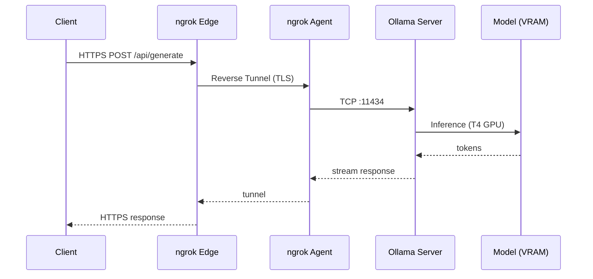

import Admonition from '@theme/Admonition';
import ShareButtons from '@site/src/components/ShareButtons';
import GitHubStarLink from '@site/src/components/GitHubStarLink';

<GitHubStarLink repo="hiroaki-com/colab-ollama-server" />

When using coding assistants like Claude Code or Continue, you often run into situations where API costs add up quickly, or you'd rather not send your code to an external service. There's also the frustration of wanting to try out lightweight local LLMs but finding that your local GPU is too slow to be practical.

This notebook solves all of that: run Ollama on Google Colab's GPU, expose the endpoint via ngrok, and you have a completely free, privacy-preserving local LLM server — all from the browser.

{/* truncate */}

### What I built

<Admonition type="tip" title="🚀 Try it now">
  No setup required. Run it in your browser from the links below.

  <ul>
    <li style={{ marginBottom: '12px' }}>
      ⚡️ Run on Google Colab<br/>
      <a href="https://colab.research.google.com/github/hiroaki-com/colab-ollama-server/blob/main/ollama_colab_free_server_en.ipynb" target="_blank" rel="noopener noreferrer">Ollama Colab Free Server (English)</a><br/>
      <small style={{ color: 'var(--ifm-color-content-secondary)' }}>Just select a model and run the cells from top to bottom.</small>
    </li>
    <li>
      🐙 View the code on GitHub<br/>
      <a href="https://github.com/hiroaki-com/colab-ollama-server" target="_blank" rel="noopener noreferrer">hiroaki-com/colab-ollama-server</a><br/>
      <small style={{ color: 'var(--ifm-color-content-secondary)' }}>Browse the source code, star, or fork the repository here.</small>
    </li>
  </ul>
</Admonition>

{/* TODO: Add demo video here */}

### Why I built this

The starting point was a [benchmarking tool I built earlier for comparing local LLMs on Google Colab](/en/docs/tech/google-colab/google-colab-ollama-multi-model-benchmarker/). While using it, I thought — what if I could use a model I liked directly as the backend for Claude Code or Continue?

Three motivations drove the project: reducing API costs (especially for token-heavy tasks like refactoring), keeping code out of external services for privacy, and the fact that my local Mac's GPU isn't powerful enough for practical Ollama inference. Google Colab's T4 GPU, available for free, seemed like the right answer to all three.

The setup — spin up a server on Colab, tunnel it through ngrok — is simple in principle, but typing commands every time is tedious. So I wrapped the whole flow, from model selection to server startup and connection config output, into a single notebook.

### How to use it

Just run the cells from top to bottom.

#### Prerequisites

You'll need a free ngrok account. Create one at the [ngrok dashboard](https://dashboard.ngrok.com/get-started/your-authtoken) and grab your auth token.

#### 1. Set the runtime

Open the notebook in Google Colab and go to Runtime > Change runtime type > select **T4 GPU**. CPU mode works too, but inference will be significantly slower, so GPU is strongly recommended.

#### 2. Select a model in Model Registry

Running the first cell (Model Registry) displays a radio button UI with the available models. The list comes with a few defaults, but you can edit the text field directly to add any model you want.

```python
model_list = "qwen3:8b, qwen3:14b, qwen2.5-coder:7b, deepseek-r1:8b"
```

Official model names can be found at [https://ollama.com/search](https://ollama.com/search). Here's a rough guide to model size performance on a T4 GPU:

| Size | Speed | Notes |
|:---:|:---:|:---|
| 8B | Fast | Recommended |
| 14B | Moderate | Practical range |
| 20B+ | Slow | Not recommended |

#### 3. Launch the Server cell

Paste your ngrok token into the Server cell and run it. The following steps are automated:

1. Install `zstd`, Ollama, and `pyngrok`
2. Start the Ollama server and run a health check
3. Establish the ngrok tunnel
4. Pull the selected model (first run: roughly 5–15 minutes)

Once complete, the connection config is printed automatically in the terminal:

```
ENDPOINT : https://xxxx.ngrok-free.app
```

#### 4. Configure your client tool

Just paste the endpoint URL into your tool of choice.

**Continue Extension (`~/.continue/config.yaml`)**

```yaml
models:
  - title: qwen3:8b
    provider: ollama
    model: qwen3:8b
    apiBase: https://xxxx.ngrok-free.app
    contextLength: 16384
```

**Claude Code (shell env)**

```bash
export ANTHROPIC_BASE_URL=https://xxxx.ngrok-free.app
export ANTHROPIC_API_KEY=dummy
claude --model qwen3:8b
```

<Admonition type="info" title="About the Anthropic protocol">
  Since Ollama v0.14.0, the Anthropic Messages API (<code>/v1/messages</code>) is officially supported. There's no need to route through an OpenAI-compatible layer — setting <code>ANTHROPIC_BASE_URL</code> to this server's endpoint connects Claude Code directly to Ollama.
</Admonition>

**OpenAI-Compatible Clients (e.g. Codex CLI)**

Append `/v1` to the base URL:

```
https://xxxx.ngrok-free.app/v1
```

<Admonition type="caution" title="Compatibility note">
  Connectivity with each tool listed here (Continue, Claude Code, OpenAI-compatible clients) has been verified. However, future updates or specification changes on the tool side may break compatibility. If you run into issues, please also consult each tool's latest documentation.
</Admonition>

### Architecture

The diagram below shows how a request travels from the client to the model.



| Component | Role |
|:---|:---|
| **Client** | The connecting tool — Continue, Claude Code, etc. |
| **ngrok Edge** | ngrok's cloud endpoint; provides a public HTTPS URL |
| **ngrok Agent** | The pyngrok process running on Colab, established via `ngrok.connect(11434)` |
| **Ollama Server** | Local server started with `OLLAMA_HOST=0.0.0.0:11434` (`OLLAMA_KEEP_ALIVE=24h`) |
| **Model (VRAM)** | The model loaded into T4 GPU VRAM; generates tokens incrementally on `/api/generate` |

### Implementation highlights

A few things worth noting about the implementation.

- **Simplified model selection UI**

    The Model Registry cell lets you freely edit the model list as a comma-separated string. Running it renders a radio button selector — so you can add or switch models without touching the code. The two-step design (edit input → select from UI) keeps things clean.

- **Automatic connection config output**

    After the server starts, the YAML config for Continue and the environment variable commands for Claude Code are printed directly to the terminal. Just copy and paste — no need to manually assemble the endpoint URL.

- **Shell injection protection**

    Passing model names directly to `subprocess.Popen` or `subprocess.run` can introduce shell injection risk depending on the input. To guard against this, model names are validated upfront against a regex, and anything outside the allowed character set raises an exception.

    ```python
    if not re.fullmatch(r'[a-zA-Z0-9._:/-]+', selected_model):
        raise ValueError(f"Invalid model name: {selected_model}")
    ```

    All official Ollama model names fall within this pattern, so there's no practical restriction.

- **Health check on startup**

    Ollama starts asynchronously, so hitting the API immediately after `subprocess.Popen` will result in a connection refusal. The notebook polls `/api/tags` every second for up to 30 attempts, proceeding once a 200 response is received. If the server never responds, a `RuntimeError` is raised.

    ```python
    for _ in range(MAX_HEALTH_RETRIES):
        try:
            if requests.get("http://0.0.0.0:11434/api/tags", timeout=HEALTH_CHECK_TIMEOUT).status_code == 200:
                break
        except requests.exceptions.RequestException:
            pass
        time.sleep(1)
    else:
        raise RuntimeError("⚠️ Ollama server failed to start.")
    ```

- **Releasing the previous ngrok tunnel**

    `ngrok.kill()` is called before `ngrok.connect()`. If you re-run the Server cell without restarting the Colab session, the previous tunnel can linger and hit the free plan's single-tunnel limit.

- **Keep Alive configuration**

    `OLLAMA_KEEP_ALIVE=24h` is set as an environment variable. By default, Ollama unloads the model from memory after idle time, causing a reload delay on the next request. Keeping it loaded for the duration of the Colab session avoids that latency.

- **Real-time uptime display**

    After startup, the elapsed time is overwritten in place using `\r`. Polling every 30 seconds also has a useful side effect: it keeps the Colab session from timing out due to inactivity.

    ```python
    while True:
        elapsed_min = int((time.time() - start_time) / 60)
        print(f"\r  ● Running  Uptime: {elapsed_min}min | {public_url}", end="")
        time.sleep(STATUS_POLL_INTERVAL)
    ```

### Things I learned along the way

**Picking a lightweight model**

On a T4 GPU, models around 8B parameters tend to strike the best balance of response speed and output quality. If you want to benchmark several candidates before committing to one, the [multi-model comparison tool](/en/docs/tech/google-colab/google-colab-ollama-multi-model-benchmarker/) can help you decide.

**Ollama has native Anthropic protocol support**

Since v0.14.0, Ollama officially supports the Anthropic Messages API (`/v1/messages`). The old workaround of converting through an OpenAI-compatible layer is no longer necessary — just point `ANTHROPIC_BASE_URL` at the Ollama endpoint and Claude Code connects directly.

### Wrapping up

This notebook came out of three goals: cut API costs, keep code off external services, and make it easy to try out local LLMs without a capable local GPU.

By packaging everything as a Google Colab notebook, anyone can spin up a free LLM server from the browser — no local GPU required. From selecting a model to getting connection-ready takes just a few minutes.

If you've been thinking "I'd love to try local LLMs but my GPU isn't up to it" or "I want to use a coding assistant without worrying about API costs," hopefully this is useful.

If you'd like to compare models before picking one, check out the [multi-model benchmarking tool](/en/docs/tech/google-colab/google-colab-ollama-multi-model-benchmarker/) as well.

<ShareButtons />

<GitHubStarLink repo="hiroaki-com/colab-ollama-server" />

### References

- [Ollama Model Library](https://ollama.com/search)
- [Ollama × Claude (Anthropic protocol support)](https://ollama.com/blog/claude)
- [ngrok Documentation](https://ngrok.com/docs)
- [pyngrok](https://pyngrok.readthedocs.io/)
- [Google Colab](https://colab.research.google.com/)
- [Continue Documentation](https://docs.continue.dev/)
- [ipywidgets Documentation](https://ipywidgets.readthedocs.io/)
- [Run free multi-model LLM benchmarks on Google Colab](/en/docs/tech/google-colab/google-colab-ollama-multi-model-benchmarker/)
