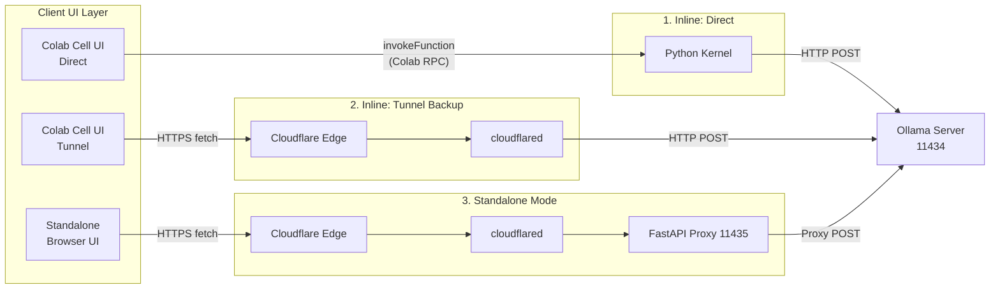
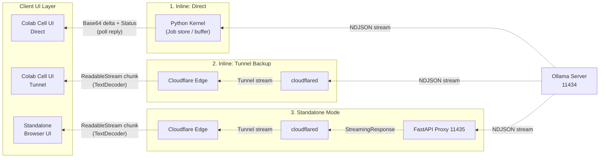

import Admonition from '@theme/Admonition';
import ShareButtons from '@site/src/components/ShareButtons';
import GitHubStarLink from '@site/src/components/GitHubStarLink';

<GitHubStarLink repo="hiroaki-com/colab-ollama-private-chat" />

<div style={{ textAlign: 'center', marginBottom: '32px' }}>
  <video
    src="https://github.com/user-attachments/assets/c6e13476-5acc-4a16-ba42-b7dae86225f2"
    aria-label="Chat Demo"
    style={{ maxWidth: '100%'}}
    autoPlay
    loop
    muted
    playsInline
    controls
  />
</div>


LLM services like ChatGPT and Claude are incredibly convenient, but there are moments when you hesitate to type in confidential business information or personal content. At the same time, new local LLM models keep appearing and there's a natural urge to try them out casually. Yet spinning up Ollama on a local GPU is a high bar — the setup effort and hardware cost are both real obstacles.

So I built a tool that runs Ollama on Google Colab's GPU and delivers a private LLM chat environment, entirely self-contained within a single notebook, with zero conversation data sent to any external API. Just run the cells top to bottom — no code to write, from server startup to chat UI, everything is ready to go.

{/* truncate */}

### What I Built

<Admonition type="tip" title="🚀 Try It Now">
  No setup required. Click the link below and run it straight in your browser.

  <ul>
    <li style={{ marginBottom: '12px' }}>
      ⚡️ Run on Google Colab<br/>
      <a href="https://colab.research.google.com/github/hiroaki-com/colab-ollama-private-chat/blob/main/ollama_colab_private_chat_en.ipynb" target="_blank" rel="noopener noreferrer">Ollama Colab Private Chat (English)</a><br/>

      <small style={{ color: 'var(--ifm-color-content-secondary)' }}>Click the link, run cells from top to bottom — that's it.</small>
    </li>
    <li>
      🐙 View the code on GitHub<br/>
      <a href="https://github.com/hiroaki-com/colab-ollama-private-chat" target="_blank" rel="noopener noreferrer">hiroaki-com/colab-ollama-private-chat</a><br/>
      <small style={{ color: 'var(--ifm-color-content-secondary)' }}>Browse the source code, leave a Star, or Fork from here.</small>
    </li>
  </ul>
</Admonition>

There are three defining characteristics. First, it is completely free, requires no external API, and protects your privacy through inference that never leaves the Colab instance. Second, it follows a stateless design that stores no logs anywhere — everything is wiped instantly on browser reload. Third, no environment setup is needed: everything from server startup to UI rendering lives in a single notebook.

Two chat UIs are available: **Inline mode**, which runs inside the Colab cell output, and **Standalone mode**, which opens in a separate browser tab. Standalone mode issues a dedicated URL, so you can access it from any other device, including a smartphone.

### Why I Built This

I had long felt uncomfortable sending text that might contain sensitive information to external LLM services. Ollama lets you run models locally, but without a personal GPU environment the options are limited.

Google Colab offers a free T4 GPU environment, and Ollama runs on it without modification. The problem is that manually going through the full flow — open Colab, start Ollama, begin chatting — every single time is simply not practical. So I decided to pack every step into one notebook.

### Key Features and Technical Highlights

Here are a few implementation details I particularly cared about.

As an overall picture, there are three distinct communication routes. Inline Direct stays entirely inside the Colab kernel, while Standalone mode flows through a FastAPI proxy and then out through Cloudflare Tunnel — the path differs significantly depending on the mode.

Request flow (Upstream):



Response flow (Downstream):



Inline Direct is the only route that uses `invokeFunction` to communicate with Ollama through the Colab kernel, returning responses as base64-encoded deltas via polling. Both the Tunnel route and the Standalone route pass through Cloudflare Tunnel, but the latter inserts FastAPI as a proxy layer in between. These differences drive the implementation decisions described below.

- **Model Selection UI with ipywidgets**

    > **ipywidgets** is a library for rendering interactive UI widgets inside Jupyter notebooks (and Google Colab). Sliders, buttons, radio buttons, and more can be drawn with pure Python code.

    The `Model Registry` cell uses ipywidgets' `RadioButtons` to render the model selection UI. Model names are managed as a comma-separated string parameter, and combining this with Colab's `#@param` notation displays them as a form UI. The selected model name is accessible from subsequent cells via `model_selector.value`.

    ```python
    model_selector = widgets.RadioButtons(
        options=AVAILABLE_MODELS,
        value=AVAILABLE_MODELS[0],
        layout=widgets.Layout(margin='0 0 0 20px')
    )
    display(widgets.VBox([header, model_selector]))
    ```

- **Background Process Management with subprocess.Popen**

    > **subprocess.Popen** is a standard library tool for launching external processes from Python in a non-blocking way. Unlike `subprocess.run`, it does not wait for the process to finish before moving on, making it well-suited for long-running processes like servers.

    The Ollama server is launched in the background using `subprocess.Popen`. The code immediately continues to the next step, then waits in a polling loop until the `/api/tags` endpoint responds successfully. This prevents errors caused by timing mismatches at startup.

    ```python
    subprocess.Popen(
        ["/usr/local/bin/ollama", "serve"],
        stdout=subprocess.DEVNULL,
        stderr=subprocess.DEVNULL,
        env=os.environ
    )

    for _ in range(MAX_HEALTH_RETRIES):
        try:
            if requests.get("http://0.0.0.0:11434/api/tags", timeout=HEALTH_CHECK_TIMEOUT).status_code == 200:
                break
        except requests.exceptions.RequestException:
            pass
        time.sleep(0.4)
    ```

- **Memory Optimization via Ollama Environment Variables**

    > **OLLAMA_FLASH_ATTENTION / OLLAMA_KV_CACHE_TYPE** are environment variables read by Ollama that control inference efficiency in Transformer models. Flash Attention improves memory efficiency during attention computation, and KV cache quantization (`q8_0`) reduces VRAM usage.

    Colab's T4 GPU has 16 GB of VRAM, but the KV cache can get tight depending on model size. Setting `OLLAMA_FLASH_ATTENTION=1` and `OLLAMA_KV_CACHE_TYPE=q8_0` allows handling longer context lengths. `OLLAMA_MAX_LOADED_MODELS=1` is also set to prevent VRAM exhaustion from multiple models being loaded simultaneously.

    ```python
    os.environ['OLLAMA_FLASH_ATTENTION']   = '1'
    os.environ['OLLAMA_KV_CACHE_TYPE']     = 'q8_0'
    os.environ['OLLAMA_MAX_LOADED_MODELS'] = '1'
    os.environ['OLLAMA_KEEP_ALIVE']        = '24h'
    ```

- **External Access to Colab via Cloudflare Tunnel**

    > **Cloudflare Tunnel (cloudflared)** is a zero-trust tunneling tool from Cloudflare. It exposes a local port behind a firewall as a temporary public URL — no account registration or token required. It works as a drop-in alternative to ngrok, with the key advantage of requiring no sign-up.

    Colab runtimes run on Google's infrastructure and have no direct path for external access. The `cloudflared tunnel --url` command creates a tunnel to `localhost:11434`, and the `trycloudflare.com` URL is extracted from `stderr` using a regex. This URL serves as the endpoint for Standalone mode and access from other devices.

    ```python
    cf_proc = subprocess.Popen(
        ['cloudflared', 'tunnel', '--url', 'http://localhost:11434'],
        stdout=subprocess.DEVNULL, stderr=subprocess.PIPE
    )
    for line in iter(cf_proc.stderr.readline, b''):
        m = re.search(r'https://[a-z0-9-]+\.trycloudflare\.com', line.decode())
        if m:
            public_url = m.group(0)
            break
    ```

- **JavaScript–Python Bridge and Streaming with google.colab.output**

    > **google.colab.output.register_callback** is a Colab-specific API that allows JavaScript running inside a cell to call Python kernel functions. Standard Jupyter requires WebSocket-based kernel communication, but Colab achieves bidirectional communication through this mechanism.

    Streaming in Inline mode works by having Python receive chunks from Ollama asynchronously in a thread, while JavaScript polls for new deltas at a fixed interval. `_stream_start` launches the thread and returns a job ID; JavaScript then calls `_stream_poll` at regular intervals to receive the unread portion as a base64-encoded byte string.

    ```python
    def _stream_start(model, messages, ctx):
        job_id = uuid.uuid4().hex
        _stream_jobs[job_id] = {'buf': b'', 'done': False, 'error': None, 'cancel': threading.Event()}
        def _run():
            with requests.post("http://localhost:11434/api/chat", json=payload, stream=True) as r:
                for line in r.iter_lines():
                    chunk = json.loads(line).get('message', {}).get('content', '')
                    _stream_jobs[job_id]['buf'] += chunk.encode('utf-8')
        threading.Thread(target=_run, daemon=True).start()
        return job_id

    def _stream_poll(job_id, offset=0):
        delta_bytes = _stream_jobs[job_id]['buf'][offset:]
        buf_b64 = base64.b64encode(delta_bytes).decode()
        return ('DONE' if is_done else 'WAIT') + '|' + buf_b64 + '|'

    output.register_callback("ollama_stream_start", _stream_start)
    output.register_callback("ollama_stream_poll",  _stream_poll)
    ```

    From JavaScript, the call is made via `google.colab.kernel.invokeFunction("ollama_stream_start", ...)`. The received base64 string is decoded and appended to the chat bubble, achieving real-time streaming display.

- **Standalone Mode with FastAPI + uvicorn**

    > **FastAPI** is an async-native Python web framework. **uvicorn** is an ASGI server implementation used to run FastAPI applications. Together they let you spin up a small web server directly on the Colab Python kernel.

    Because Standalone mode cannot rely on Colab cell output, a FastAPI app is run with uvicorn and hosts an independent HTML page. uvicorn is started in the background via `threading.Thread`, requests to Ollama are proxied using `httpx`, and responses are returned to the Standalone frontend as a `StreamingResponse`.

    ```python
    app = FastAPI()

    @app.get("/", response_class=HTMLResponse)
    async def index():
        return _STANDALONE_UI_HTML

    @app.post("/api/chat")
    async def chat_proxy(request: Request):
        body = await request.json()
        async def generate():
            async with httpx.AsyncClient(timeout=300) as client:
                async with client.stream("POST", "http://localhost:11434/api/chat", json=body) as r:
                    async for chunk in r.aiter_bytes():
                        yield chunk
        return StreamingResponse(generate(), media_type="application/x-ndjson")

    threading.Thread(
        target=uvicorn.run,
        kwargs={"app": app, "host": "0.0.0.0", "port": 11435},
        daemon=True
    ).start()
    ```

    A separate Cloudflare Tunnel is also started pointing to `localhost:11435`, so anyone — including smartphone users — can chat simply by visiting the issued URL.

- **Markdown Rendering with marked.js + DOMPurify**

    > **marked.js** is a JavaScript library that converts Markdown strings to HTML in the browser. **DOMPurify** is a sanitization library that strips XSS-vulnerable elements from the converted HTML.

    LLM responses frequently contain Markdown — code blocks, bullet lists, and so on — so the text is converted to HTML via `marked.parse()` before being rendered in the chat bubble. The result is always passed through `DOMPurify.sanitize()`, ensuring that even if a model outputs malicious HTML, XSS attacks are blocked.

    ```javascript
    const html = DOMPurify.sanitize(marked.parse(rawText));
    bubble.innerHTML = html;
    ```

### How to Use It

Simply run the cells from top to bottom.

1. **Model Registry**: Enter the model names you want to use as a comma-separated list, then select one with the radio button. You can find available model names at [ollama.com/search](https://ollama.com/search).
2. **Server**: Ollama installation, model download, and Cloudflare Tunnel startup all run automatically. The first time, model download may take a few minutes.
3. **Chat UI**: Run either `Inline` (operates within the cell) or `Standalone` (opens in a separate tab) to start chatting.

You can adjust the context length (default: 4096 tokens) with the `num_ctx` parameter. Tune it based on the balance between model size and VRAM usage.

### Wrapping Up

This project started from my own need to chat with an LLM on Colab without relying on any external API. Piecing together the parts — Ollama server management, securing external access via Cloudflare Tunnel, and a streaming design tailored to Colab's constraints — involved a fair amount of trial and error. The JavaScript–Python bridge in Inline mode was especially tricky: the timing of callback registration and the choice of polling strategy took real thought. Still, within the constraint of keeping everything self-contained in a single notebook, I think it landed in a practical place.

If you care about privacy when using LLMs, or if you're looking for another way to put Colab's GPU to work, I hope this is useful to you.

<ShareButtons />

<GitHubStarLink repo="hiroaki-com/colab-ollama-private-chat" />

### References

- [Ollama Documentation](https://github.com/ollama/ollama/blob/main/docs/README.md)
- [Ollama API Reference](https://github.com/ollama/ollama/blob/main/docs/api.md)
- [Cloudflare Tunnel Documentation](https://developers.cloudflare.com/cloudflare-one/connections/connect-networks/)
- [Google Colab](https://colab.research.google.com/)
- [ipywidgets Documentation](https://ipywidgets.readthedocs.io/)
- [FastAPI Documentation](https://fastapi.tiangolo.com/)
- [marked.js](https://marked.js.org/)
- [DOMPurify](https://github.com/cure53/DOMPurify)
